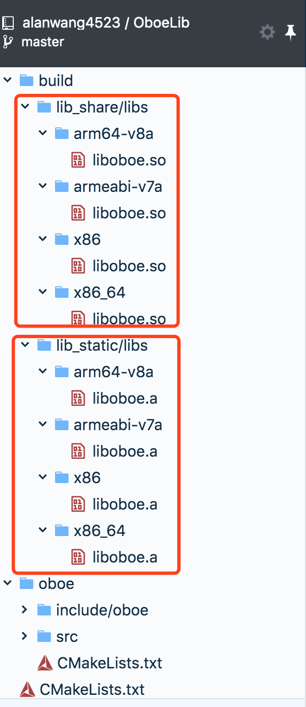
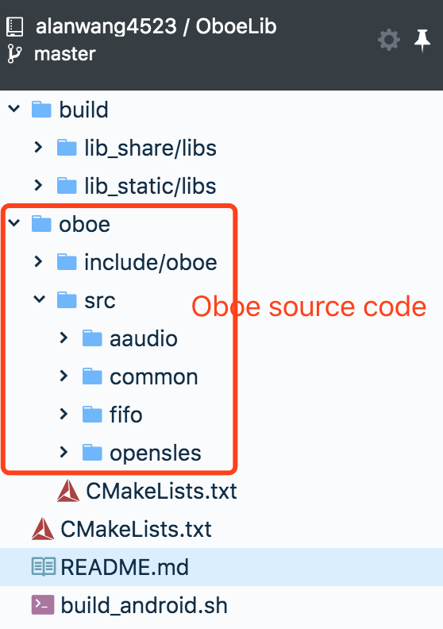
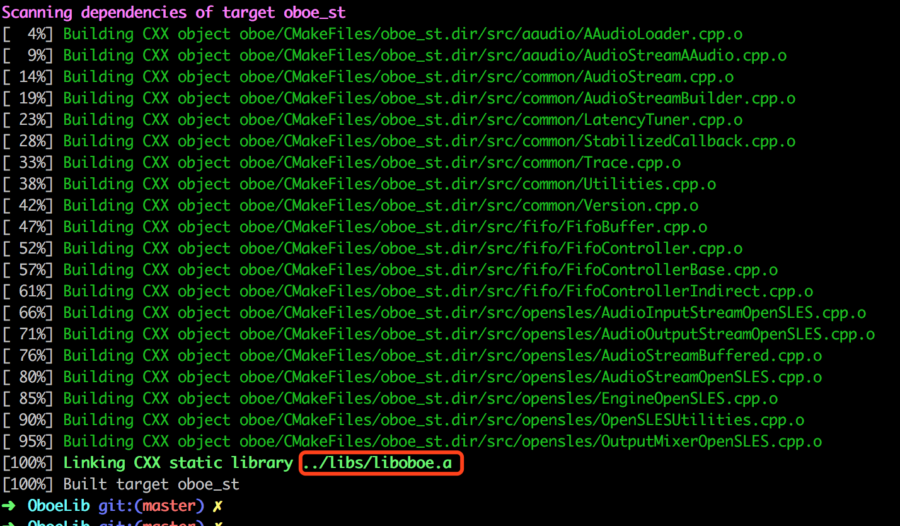

## OboeLib

**The project provide CMakeList.txt and build script to build statically linked libraries (liboboe.a) and dynamically linked libraries (liboboe.so) for [Oboe](https://github.com/google/oboe)**

There are two ways to use:

- **Use the  libraries that i have built on Oboe release version [1.2.0](https://github.com/google/oboe/releases/tag/1.2.0)**

​     

- **Build with the version you want by your self**

  1. download the oboe source codes that the version you need

  2. replace the source code in oboe directory by your downloads

     

  3. change MY_NDK、MY_SDK、MY_CMAKE as your own path in build_android.sh

     ```shell
     # You should set the MY_NDK、MY_SDK、MY_CMAKE as your own path
     MY_NDK="/Users/AlanWang/AndroidDev/sdk/ndk-bundle"
     MY_SDK="/Users/AlanWang/AndroidDev/sdk"
     MY_CMAKE="${MY_SDK}/cmake/3.6.3155560/bin/cmake"
     ```

  4. enter the project root directory, and execute : 

     ```sh
     ./build_android.sh
     ```

     

  5. finally you will see that libraries in build directory


